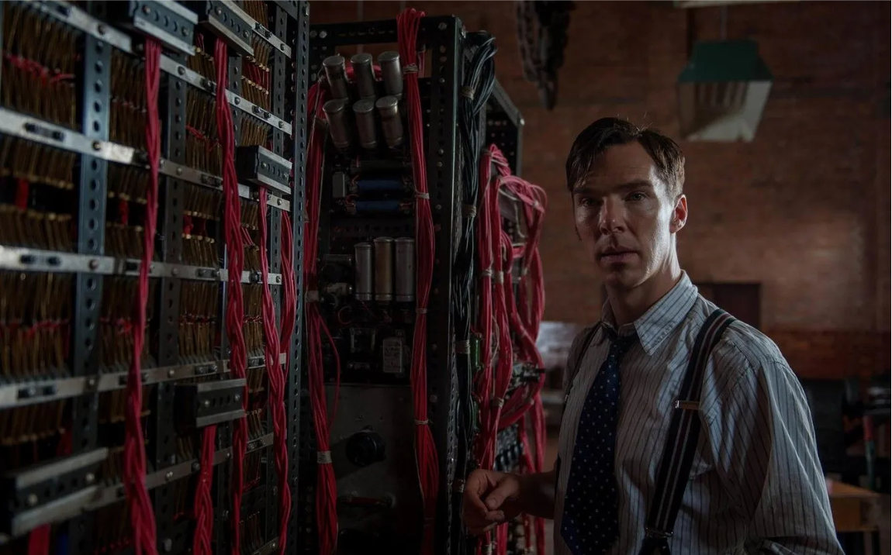
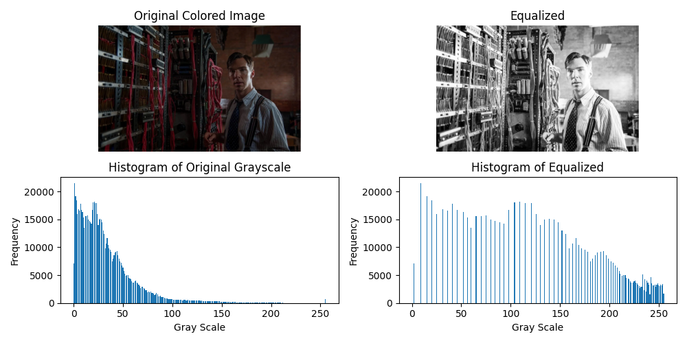
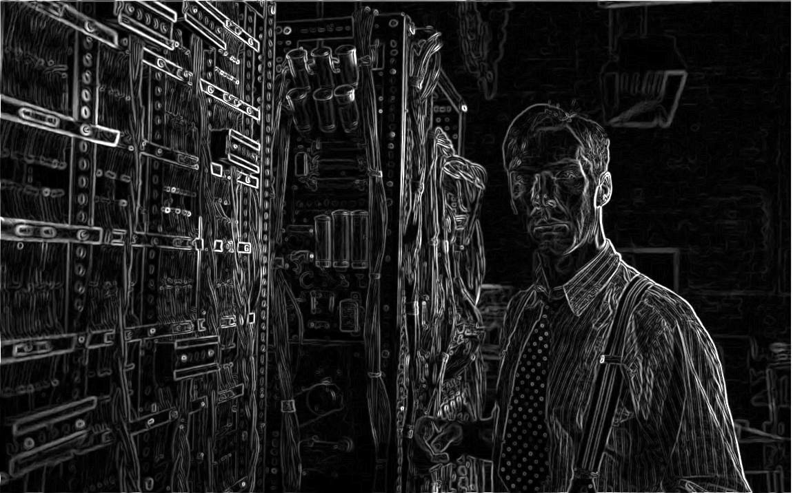
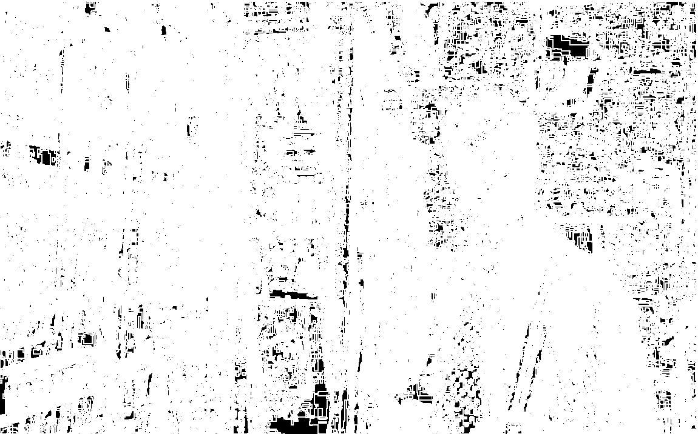
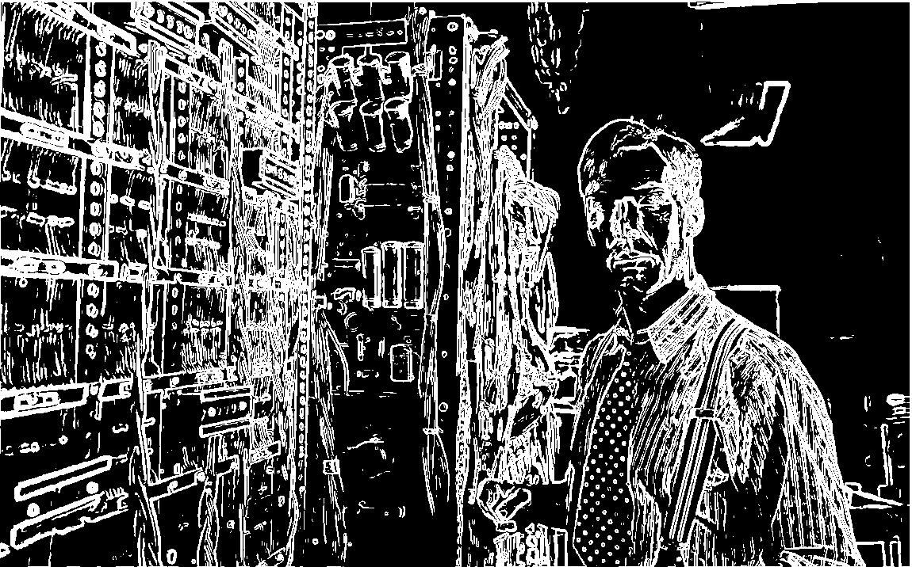

# 2024 Multimedia HW3

## Prerequisites
Make sure that you have python and pip installed on your computer.

Run
```bash
$ python3 -m pip install -r requirements.txt
```
to get all you need to run the code.

## Usage
Simply run
```bash
$ python3 main.py <image file path>
```
to get the results.

A sample image file `Histogram+Edge.bmp` in this directory is used as the example for the following description.



## Histogram Equalization
The main package used here to compute image data is `opencv`.

```python
from cv2 import imread, cvtColor, COLOR_BGR2RGB, COLOR_BGR2GRAY, COLOR_GRAY2RGB, GaussianBlur, imshow, normalize, NORM_MINMAX, threshold, THRESH_BINARY, namedWindow, createTrackbar, imwrite
from sys import argv
from matplotlib.pyplot import subplots, tight_layout, savefig, show
from numpy import histogram, array, zeros, zeros_like, where, sum, round
```

Methods are detailed below.

First, I simply read in the input image, show it, convert it to grayscale, and make the histogram of it.

```python
    cimg = imread(argv[1])
    assert cimg is not None, "file could not be read, check with os.path.exists()"

    _, axes = subplots(2, 2, figsize=(10, 5))
    axes[0][0].imshow(cvtColor(cimg, COLOR_BGR2RGB))
    axes[0][0].set_title('Original Colored Image')
    axes[0][0].axis('off')

    cimg = cvtColor(cimg, COLOR_BGR2GRAY)

    # bins = 0 ~ 256
    # so x = 0 ~ 256
    y, x = histogram(cimg.flatten(), bins=range(257))
    # x will have one element more than y, and that element is the upper bound. In this case, x[-1] = 256.
    # This is because the last bin is [255, 256) to include 255.
    axes[1][0].bar(x[:-1], y)
    axes[1][0].set_xlabel('Gray Scale')
    axes[1][0].set_ylabel('Frequency')
    axes[1][0].set_title('Histogram of Original Grayscale')
```

Then, I apply the Histogram Equalization by pdf and cdf.

```python
    # Histogram Equalization
    pdf = y / sum(y)
    y_normalized = pdf * 255
    cdf = round(y_normalized.cumsum()).astype('uint8')

    # Now, cdf can act like a map, so the Histogram Equalization of cimg is cdf[cimg].
    img = cdf[cimg]
    axes[0][1].imshow(cvtColor(img, COLOR_GRAY2RGB))
    axes[0][1].set_title('Equalized')
    axes[0][1].axis('off')

    y, x = histogram(img.flatten(), bins=range(257))
    axes[1][1].bar(x[:-1], y)
    axes[1][1].set_xlabel('Gray Scale')
    axes[1][1].set_ylabel('Frequency')
    axes[1][1].set_title('Histogram of Equalized')

    ...

    tight_layout()
    show()
```

The result looks like this



## Edge Detection

After the image was histogram equalized, I apply Edge Detection by smoothing it, convolute it with sobel x and sobel y matrices, prevent it from overflowing, and normalize it.

```python
    # Edge Detection
    sobel_x = array([[-1, 0, 1], [-2, 0, 2], [-1, 0, 1]])
    sobel_y = sobel_x.T

    img = GaussianBlur(cimg, (3, 3), 0)
    zero_padding = zeros((img.shape[0] + 2, img.shape[1] + 2)).astype('int32')
    zero_padding[1:-1, 1:-1] = img
    res = zeros_like(img).astype('int32')

    for x in range(img.shape[0]):
        for y in range(img.shape[1]):
            res_x = sum(zero_padding[x : x + 3, y : y + 3] * sobel_x) ** 2
            res_y = sum(zero_padding[x : x + 3, y : y + 3] * sobel_y) ** 2
            res[x, y] = (res_x + res_y) ** 0.5

    img = normalize(where(res > 255, 255, res).astype('uint8'), None, 0, 255, NORM_MINMAX)
    ...
```



That looks cool, right? But it looks blurry, and edges shouldn't be blurry, so I turn it binary.

```python
def apply_threshold(lb):
    global img
    _, timg = threshold(img, lb, 255, THRESH_BINARY)
    imshow('Edge Detection', timg)
    # imwrite('result2.png', timg)
```

At this point, the only thing that is left to do is give it a threshold. Otherwise, it could look messy since all positive values are white.



Don't worry. A track bar is provided below the picture on the window so you can slide it however you like to get the best result for you.

```python
    ...
    namedWindow('Edge Detection')
    createTrackbar('Lower Bound:', 'Edge Detection', 0, 255, apply_threshold)
    apply_threshold(0)
```


